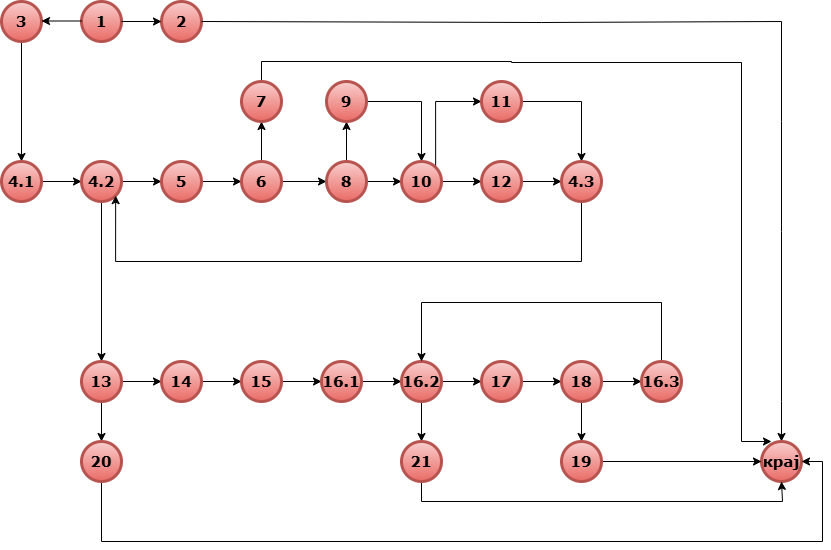

# Втора лабораториска вежба по Софтверско инженерство

## Сара Трајкоска, бр. на индекс 236047

###  Control Flow Graph



### Цикломатска комплексност

Цикломатската комплексност на овој код е 9, истата ја добив преку формулата P+1, каде што P е бројот на предикатни јазли. Во случајoв P=8, па цикломатската комплексност изнесува 9. Според бројот на региони може да се определува цикломaтската комплексноcт, така што графот има 9 региони со што докажавме дека и цикломатската комплексност е 9.

### Тест случаи според критериумот  Every statement 

```java
public class SILab2Test {

   @Test
    void everyStatementTest() {
        //Т1 Null list фрла исклучок
        assertThrows(RuntimeException.class, () -> SILab2.checkCart(null, "1234567890123456"));

        //Т2 Item со null име фрла исклучок
        Item nullName = new Item(null, 1, 100, 0);
        assertThrows(RuntimeException.class, () -> SILab2.checkCart(List.of(nullName), "1234567890123456"));

        //Т3 валиден Item со сите услови исполнети,попуст и -30
        Item item = new Item("TV", 12, 400, 0.2);
        double expected = 400 * 0.8 * 12 - 30;
        assertEquals(expected, SILab2.checkCart(List.of(item), "1234567890123456"), 0.001);

        //Т4 невалиден број на картичка(букви)
        Item valid = new Item("Mouse", 1, 100, 0);
        assertThrows(RuntimeException.class, () -> SILab2.checkCart(List.of(valid), "1234abcd5678efgh"));

        //Т5 невалиден број на картичка(<16 цифри)
        assertThrows(RuntimeException.class, () -> SILab2.checkCart(List.of(valid), "12345678"));
    }
```

### Тест случаи според критериумот Every path

```java
public class SILab2Test {


 @Test
    void MultipleCondition() {
        //T1 TXX-само условот за цена(> 300) е исполнет
        //-30 поени
        Item i1 = new Item("Laptop", 2, 500, 0);
        double expected1 = 500 * 2 - 30;
        assertEquals(expected1, SILab2.checkCart(List.of(i1), "5555666677778888"), 0.001);
        System.out.println("TXX test successful");

        //Т2 FTX-само условот за попуст(> 0) е исполнет
        //пресметка со попуст и -30 поени
        Item i2 = new Item("Mouse", 4, 200, 0.2);
        double expected2 = 200 * 0.8 * 4 - 30;
        assertEquals(expected2, SILab2.checkCart(List.of(i2), "9999000011112222"), 0.001);
        System.out.println("FTX test successful");

        //Т3 FFT-само условот за количина(> 10) е исполнет
        //нормална пресметка без попуст ама со -30 поени
        Item i3 = new Item("Cable", 11, 50, 0);
        double expected3 = 50 * 11 - 30;
        assertEquals(expected3, SILab2.checkCart(List.of(i3), "3333444455556666"), 0.001);
        System.out.println("FFT test successful");

        //Т4 FFF-ниту еден услов не е исполнет
        //нормална пресметка без попуст и без одземање
        Item i4 = new Item("Pen", 1, 100, 0);
        double expected4 = 100 * 1;
        assertEquals(expected4, SILab2.checkCart(List.of(i4), "2222333344445555"), 0.001);
        System.out.println("FFF test successful");
    }
}
```
### Објаснување на напишаните unit tests

<b>1. Тест случаи според критериумот  Every statement</b>

За тест случаите според критериумот Every Statement овозможуваат секој ред од кодот да се извршува барем еднаш така што: 

- <b> Тест случај бр.1</b> 

    Овој тест случај проверува дали методот ќе фрли исклучок кога листата со производи е null и првиот услов во методот поминува кој фрла RuntimeException.
- <b> Тест случај бр.2</b>

    Овој тест случај проверува дали ќе се фрли исклучок кога некој производ во листата нема име.
- <b> Тест случај бр.3</b>

    Овој тест случај проверува производ кој има цена поголема од 300, попуст поголем од 0 и количина поголема од 10 и поминуваат условот за -30(барем еден од условите да е исполнет), попуст и валидацијата на картичка .
- <b> Тест случај бр.4</b>

    Овој тест случај проверува дали ќе се фрли исклучок ако картичката содржи карактери што не се цифри.
- <b> Тест случај бр.5</b>

    Овој тест случај проверува дали ќе се фрли исклучок кога должината на бројот на картичката е помала од 16.

<b>2. Тест случаи според критериумот Every path</b>

За тест случаите според критериумот Every path се проверува логичкиот израз каде што има различни четири комбинации на три услови поврзани со или операторот,секој тест тестира различен дел од условот за да се покрие во целост.
```java
if (item.getPrice() > 300 || item.getDiscount() > 0 || item.getQuantity() > 10)
```

- <b> Тест случај бр.1</b> 

    TXX(само условот за цена(> 300) е исполнет)-oвој тест случај проверува производ со цена >300, но без попуст и нормална количина.Условот за висока цена е исполнет, -30 и не се пресметува попуст.
- <b> Тест случај бр.2</b>

    FTX(само условот за попуст(> 0) е исполнет) е исполнет)-oвој тест случај проверува производ со попуст, но со нормална цена и количина.Условот за попуст е задоволен, се одзема 30 и се пресметува попустот
- <b> Тест случај бр.3</b>

     FFT(само условот за количина(> 10) е исполнет)-oвој тест случај проверува производ со голема количина, но без попуст и со ниска цена.Условот за попуст е исполнет, се одзема 30 и се пресметува попустот

 - <b> Тест случај бр.4</b>

    FFF(ниту еден услов не е исполнет)-oвој тест случај проверува производ со нормална цена, количина и без попуст и кога ниту еден услов не е исполнет.
